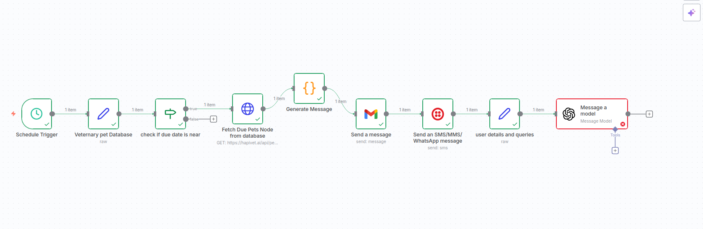

# Project: AI-based Veterinary Practice Automation
## Problem in Existing System

- Veterinary clinics using Hapivet.ai currently face the following issues:

- Manual Client Communication

- Sending vaccination reminders, follow-ups, and aftercare instructions is mostly manual.

- Leads to missed reminders or inconsistent communication.

- High Administrative Workload

- Staff spend significant time tracking schedules, sending emails/SMS, and answering repetitive client queries.

- Limited AI Assistance

- No integrated AI to answer common pet-care questions automatically.

- Clients often have to call or wait for responses to basic queries like feeding, symptoms, or minor first aid.

- Disconnected Workflow

# Current system lacks continuous automation:

- Client data is not automatically checked for due vaccinations.

- Emails, SMS, and AI responses are not integrated in one flow.

# Impact:

- Reduced client satisfaction.

- Risk of missed vaccinations.

- Inefficient use of staff time.

# Proposed System

- The proposed system automates veterinary tasks using n8n, OpenAI, and Twilio/email services:

- Automated Reminders: Sends vaccination and follow-up notifications via email/SMS.

- AI Chat Assistance: Answers client questions about feeding, symptoms, and minor care instantly.

- Continuous Workflow: Checks due dates, triggers messages, and AI responses automatically.

- Centralized & Scalable: Combines all tasks in a single flow, reducing human error and staff workload.

  # Workflow Architecture

## Scheduler Node → triggers workflow periodically.

## Set/Webhook Node → holds or receives client data.

## IF Node → checks vaccination due date:

- TRUE → sends Email/SMS reminders first.

- FALSE → skips reminders.

## OpenAI Chat Node → generates responses to client questions after notifications.

## Function Node → formats AI responses for delivery.

## Email/Twilio Node → sends AI-generated messages if needed.

## This ensures clients first get important reminders, then receive AI assistance if they have questions.
